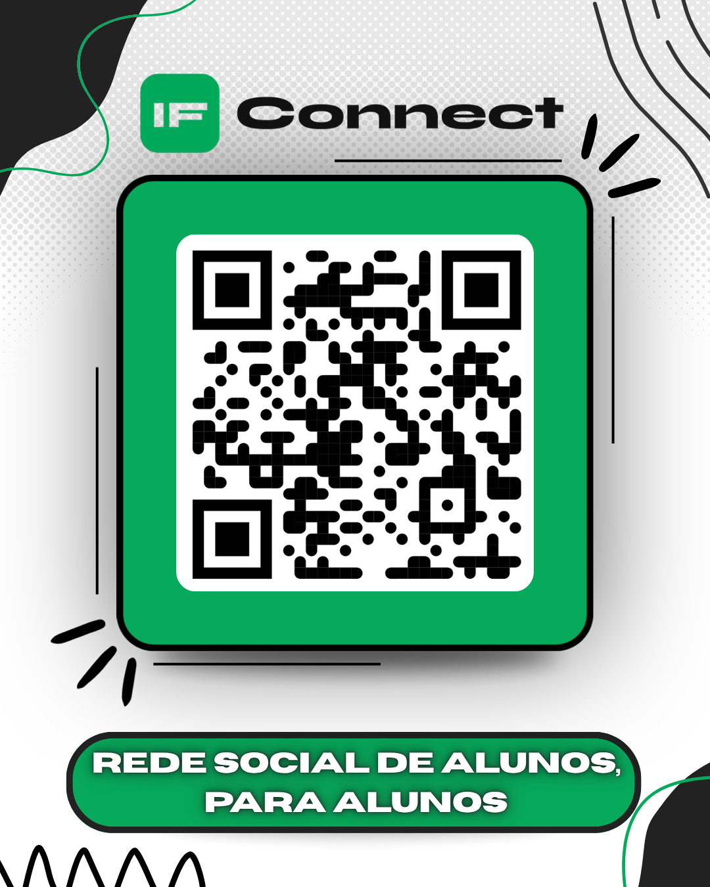

# IFConnect

Plataforma web de rede social acadêmica, desenvolvida para conectar estudantes, professores e administradores em um ambiente digital integrado, com feed, chat e recursos de moderação.

## 📸 Preview

<table>
  <tr>
    <td></td>
    <td></td>
  </tr>
  <tr>
    <td align="center"><sub>Feed</sub></td>
    <td align="center"><sub>Avisos</sub></td>
  </tr>
  <tr>
    <td></td>
    <td></td>
  </tr>
  <tr>
    <td align="center"><sub>Explorar</sub></td>
    <td align="center"><sub>Perfil</sub></td>
  </tr>
  <tr>
    <td></td>
    <td></td>
  </tr>
  <tr>
    <td align="center"><sub>Resumos</sub></td>
    <td align="center"><sub>Laboratórios</sub></td>
  </tr>
  <tr>
    <td></td>
    <td></td>
  </tr>
  <tr>
    <td align="center"><sub>Painel Admin</sub></td>
    <td align="center"><sub>QR Code de acesso</sub></td>
  </tr>
</table>

## Sobre

O IFConnect foi criado para centralizar a comunicação acadêmica de uma instituição de ensino, unindo em um só lugar recursos de rede social (feed, posts, curtidas, seguidores), comunicação em tempo real (chat privado e em grupo) e gestão de conteúdo institucional, com diferentes níveis de acesso para alunos, professores e administradores.

## Funcionalidades

Confirmado por inspeção do código-fonte (`src/app.js`, ~4.800 linhas), que implementa integração direta com Firebase Authentication e Firebase Realtime Database:

- [x] Cadastro de usuários e login por e-mail/senha
- [x] Login com Google (`GoogleAuthProvider` / `signInWithPopup`)
- [x] Verificação de e-mail (`sendEmailVerification`)
- [x] Recuperação de senha (`sendPasswordResetEmail`)
- [x] Perfis de usuário com `handle` único, foto e curso/disciplina
- [x] Feed de postagens, com curtidas, upvotes e comentários
- [x] Sistema de seguidores (feed personalizado por quem o usuário segue)
- [x] Chat privado e em grupo (mensagens em tempo real via Realtime Database)
- [x] Notificações e indicadores de mensagens não lidas
- [x] Sistema de badges/conquistas (ex.: primeiro post, 10 posts, 100 curtidas, veterano)
- [x] Sistema de cargos (aluno, professor, administrador) com permissões distintas
- [x] Moderação de conteúdo (fila de moderação, denúncias de posts)
- [x] Painel de administração (gestão de cargos de outros usuários)

## Tecnologias

### Frontend

- HTML5
- CSS3
- JavaScript (vanilla, sem framework/bundler)

### Backend / Dados

- Firebase Authentication (e-mail/senha e Google)
- Firebase Realtime Database

## Como funciona

A aplicação é uma SPA em JavaScript puro (`src/app.js`) que se conecta diretamente ao Firebase pelo SDK client-side. Todo o estado (usuários, posts, mensagens, configurações, moderação) é lido e escrito em tempo real na Realtime Database (`DB.ref(...)`), sem backend próprio — a lógica de permissões por cargo (aluno/professor/administrador) é tratada no próprio código do cliente.

## Estrutura do projeto

```
src/
├── index.html    # Marcação e telas da aplicação
├── style.css      # Estilos
└── app.js          # Toda a lógica: autenticação, feed, chat, moderação, badges

screenshots/        # Capturas de tela e QR Code do projeto
```

## Como executar

### Pré-requisitos

- Um navegador
- Um projeto Firebase com Authentication (e-mail/senha e Google) e Realtime Database habilitados

### Instalação e configuração

```bash
git clone <URL-do-repositorio>
cd plataforma-comunicacao/src
```

Edite `FIREBASE_CONFIG` no início de `app.js` com as credenciais do seu projeto Firebase (Firebase Console → Configurações do Projeto → Seus apps):

```js
const FIREBASE_CONFIG = {
  apiKey:            "SUA_API_KEY",
  authDomain:        "SEU_PROJECT_ID.firebaseapp.com",
  databaseURL:       "https://SEU_PROJECT_ID-default-rtdb.firebaseio.com",
  projectId:         "SEU_PROJECT_ID",
  storageBucket:     "SEU_PROJECT_ID.firebasestorage.app",
  messagingSenderId: "SEU_MESSAGING_SENDER_ID",
  appId:             "SEU_APP_ID"
};
```

Em seguida, abra `index.html` diretamente no navegador ou sirva a pasta com qualquer servidor estático (ex.: `npx serve .`).

> **Atenção:** as credenciais do Firebase ficam expostas em texto plano em `app.js`. Como não há build/bundler no projeto, não é possível usar variáveis de ambiente (`.env`) da forma convencional — se este projeto for publicado, considere restringir o domínio autorizado a usar essas credenciais nas configurações do Firebase Console e revisar as regras de segurança da Realtime Database antes de ir para produção.

## Autor

Muryllo Douglas

## Licença

Todos os direitos reservados. Este projeto é disponibilizado apenas para fins de portfólio e educacionais — nenhuma parte do código pode ser copiada, modificada, distribuída ou reutilizada em outros projetos sem autorização prévia por escrito do autor (ver [`LICENSE`](./LICENSE)).
